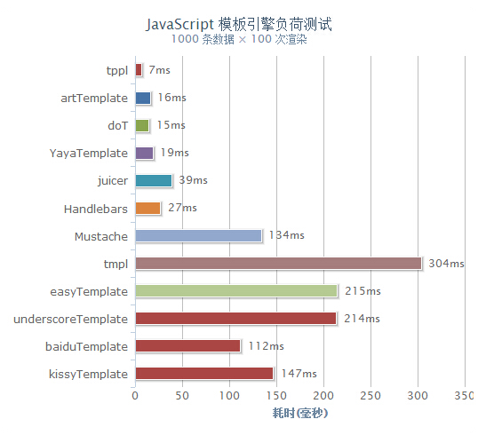
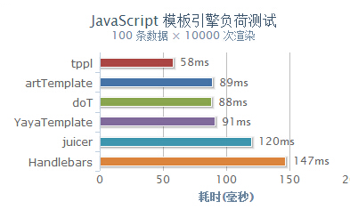

tppl.js
=======

**全球最快的 js 模板引擎**

## 特性

1.  代码精简，就一个函数，方便嵌入任何位置
2.	性能卓越，为目前最快的模板引擎（[性能测试](http://yangjiepro.github.io/tppl/test/test.htm)）
3.	编译缓存，一次编译重复渲染使用
4.	无模板语法，使用原生js
5.	兼容Node.js及所有流行的浏览器

## 快速上手

**编写模板**

使用一个``type="text/html"``的``script``标签存放模板：
	
	<script id="test" type="text/html">
	[: if (admin){ :]
		[: for (var i=0;i<list.length;i++) { :]
			<div>[=:i:]. [=:list[i].user:]</div>
		[:}:]
		[=:this.name||"name is not found !":]
	[:}:]
	</script>

**渲染模板**
	
	var data = {
		title: '标签',
		list: ['文艺', '博客', '摄影', '电影', '民谣', '旅行', '吉他']
	};
	var html = tppl(document.getElementById('test').innerHTML, data);

## 方法

#### tppl(tpl, data, fast)

返回渲染好的模板内容。参数`fast`表示是否采用[极速模式](#极速模式)

#### tppl(tpl)

返回渲染函数。

#### tppl(tpl, null, fast)

返回渲染函数（极速模式）。

```
var tpl = "..." , data = {...};
var render = tppl(tpl); //渲染函数
var html = render(data);  //重复使用
var html = render(data, true);  //极速模式渲染
```

## 语法

字段 | 类型 | 值| 说明
------------ | ------------- | ------------ | ------------
openTag | String | ``[:`` | 逻辑语法开始标签
closeTag | String | ``:]`` | 逻辑语法结束标签
valueTag | String | ``[=:`` | 输出变量开始标签
valueTag | String | ``:]`` | 输出变量结束标签

**变量默认值**

为未定义的或值为`假`的变量给出默认值：

```
[=:foo||"变量foo存在但值为假":]

[=:this.foo||"变量foo不存在或为假!":]
```

**避免未定义的变量引起系统崩溃**

若模板中定义了一个变量输出，而且传入数据却少了这个项目就会出现变量未定义的错误，从而引起整个程序的崩溃。如果无法确保数据完整性，仍然有方法可以对对其成员进行探测。在需要检测的变量前加关键字 this，如：
```
[: if (this.dataName !== undefined) { :]
      [=: dataName :]
[: } :]
```

## 极速模式

tppl 有两种模式可供选择。

**极速模式**

在对性能有极高要求的场景下，采用极速模式可大幅提升编译渲染性能，但需要需要牺牲一部分便捷性：需要在每个模板变量前加关键字`this`。但模板类定义的局部变量则不需要。例如：
```
<h1> [=:this.title:] </h1>
<ul>
    [: for (var val, i = 0, l = this.list.length; i < l; i ++) { :]
        [: val = this.list[i]; :]
        <li>用户: [=:val.user:]/ 网站：[=:val.site:]</li>
    [: } :]
</ul>
```

**普通模式**

可以省略关键字 `this`，方便的输出变量：
```
<h1> [=:title:] </h1>
<p>
    [=:content||"暂无内容":] 
</p>
```

## 下载

* [tppl.js](https://github.com/yangjiePro/tppl/blob/gh-pages/tppl.js) *(原生语法, 1.19kb)* 
	
## 性能测试：



“第一梯队”效率测试：



tppl 的编译渲染速度是著名的 jQuery 作者 John Resig 开发的 tmpl 的 **43** 倍！与第二名 artTemplate 也有一倍的差距。 查看 [性能测试](http://yangjiepro.github.io/tppl/test/test.htm) ，单次结果不一定准确，请多测几次。

## 授权协议

Released under the MIT, BSD, and GPL Licenses

============

© yangjie@jojoin.com
